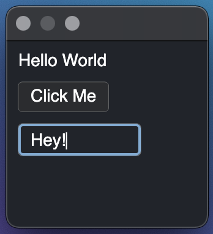

# fluxe

Fluxe is a cross platform UI library written in C++ that uses [Skia](https://skia.org/) as the rendering backend.

I needed a modern, non bloated, fast, feature rich, cross platform UI lib.

Some of the current cross platforms alternatives are:
 - [Dear ImGui](https://github.com/ocornut/imgui) is intermediate mode, so it's not ideal if you don't already have an existing run loop (as in games).
 - [Qt](https://www.qt.io/) has a restrictive license, is bloated, and forces you to use their tools. It's not easy to just embed it and make it work with existing code.
 - [WxWidgets](https://www.wxwidgets.org/) is pretty old and outdated.
 - [React Native](https://reactnative.dev/) and [React Native Desktop](https://microsoft.github.io/react-native-windows/) are hard to embed into existing applications, force you to use react/js, and performance isn't always great.
 - [Flutter](https://flutter.dev/) also uses Skia and is pretty fast, but focuses on mobile and you have to use Dart as a scripting language, since much of it is written in Dart.

Currently supported platforms are Mac and Windows, but adding Mobile should be straightforward.

## Example

```c++
#include "fluxe/views/View.h"
#include "fluxe/views/Text.h"
#include "fluxe/views/Button.h"
#include "fluxe/views/TextInput.h"
#include "fluxe/layout/StackLayout.h"
#include "fluxe/views/EngineUtility.h"

#include <iostream>

using namespace fluxe;

#if _WIN32
#include <windows.h>

int WINAPI WinMain(HINSTANCE inst, HINSTANCE prev, LPSTR cmd, int show) {
#else
int main() {
#endif


  auto text = Object<Text>::Create();
  text->setText("Hello World");

  auto button = Object<Button>::Create();
  button->getTitle()->setText("Click Me");
  button->onClick = [&text] (ObjectPointer<Button> btn) {
    std::cout << "Clicked" << std::endl;
    text->removeFromParent();
  };

  auto textInput = Object<TextInput>::Create();

  auto container = Object<View>::Create();
  auto layout = Object<StackLayout>::Create();
  layout->spacing = 10.0;
  container->setLayout(layout);
  container->addSubView(text);
  container->addSubView(button);
  container->addSubView(textInput);

  EngineUtility::startWithView(container);

  return 0;
}

```



## Features

Done:
 - View hierarchy
 - Text
 - Text Input with selection, keyboard navigation, context menu
 - Rich Text with font sizes, font families, colors, italic, underlined, line through
 - Button
 - View focusing
 - View Padding
 - Absolute positioning
 - Absolute sizing
 - Stack Layout
 - Flex Layout
 - Background colors
 - Rounded corners
 - Border color and width

Planned:
 - Scroll View
 - Check box
 - Radio buttons
 - Grid Layout
 - Clipboard support
 - Drag & Drop
 - Different rendering strategies. Currently if there's an update that triggers a redraw, the render pipeline redraws every element. Often it is not required to redraw everything, instead it can be reused from the previous render cycle. This is a trade off between CPU and memory, but fluxe is written in a way that should make it simple to adjust it to your needs. For example if you're restricted in memory, redrawing everything might be what you want, whereas if memory isn't an issue, it's probably better to reuse already rendered components and save CPU.

## Building

This project is using Cmake and premake5 to generate project files (Xcode, Visual Studio) for local development, as well as makefiles for building releases. The premake stuff will be removed.

To get your build environment set up, you first have to run this command:

```
python prepare.py
```
This will give you a project file in the `dev` directory that you can use to run different examples.


The following command will build Skia and the fluxe static library. You need these to run the examples and to create a release.
Note that for building Skia you need both python3 and python2 intalled.

```
python build.py
```

Finally, to publish the static library and header files to github, run:

```
python publish.py
```
